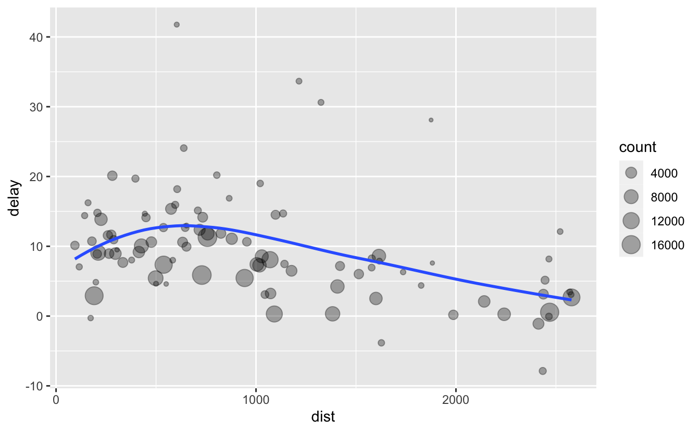

# (PART) Manipulation {-} 

# Basics


```r
library(tidyverse)
library(nycflights13)
```

## dplyr basics

In this section you will learn about three important dplyr functions that give you basic data manipulation power:

* Pick observations by their values (`filter()`).
* Create new variables from existing variables (`mutate()`).
* Collapse many values down to a single summary (`summarize()`).

These can all be used in conjunction with `group_by()`, which changes the scope of each function from operating on the entire dataset to operating on it group-by-group. 

You can use the [Data Transformation cheatsheet](https://github.com/rstudio/cheatsheets/blob/master/data-transformation.pdf) to jog your memory, and learn about other dplyr functions we'll cover in the future.

All dplyr verbs work similarly: 

1.  The first argument is a data frame.

1.  The subsequent arguments describe what to do with the data frame.
    
1.  The result is a new data frame.

Together these properties make it easy to chain together multiple simple steps to achieve a complex result. Let's dive in and see how these verbs work.

## Filter rows with `filter()`

`filter()` allows you to subset observations based on their values. The first argument is the name of the data frame. The second and subsequent arguments are the expressions that filter the data frame. For example, we can select all flights on January 1st with:


```r
flights %>% 
  filter(month == 1, day == 1)
#> # A tibble: 842 × 19
#>    year month   day dep_time sched_dep_time dep_delay arr_time sched_arr_time
#>   <int> <int> <int>    <int>          <int>     <dbl>    <int>          <int>
#> 1  2013     1     1      517            515         2      830            819
#> 2  2013     1     1      533            529         4      850            830
#> 3  2013     1     1      542            540         2      923            850
#> 4  2013     1     1      544            545        -1     1004           1022
#> 5  2013     1     1      554            600        -6      812            837
#> 6  2013     1     1      554            558        -4      740            728
#> # … with 836 more rows, and 11 more variables: arr_delay <dbl>, carrier <chr>,
#> #   flight <int>, tailnum <chr>, origin <chr>, dest <chr>, air_time <dbl>,
#> #   distance <dbl>, hour <dbl>, minute <dbl>, time_hour <dttm>
```

When you run that line of code, dplyr executes the filtering operation and returns a new data frame. dplyr functions never modify their inputs, so if you want to save the result, you'll need to use the assignment operator, `<-`:


```r
jan1 <-
  flights %>% 
  filter(month == 1, day == 1)
```

### Comparisons

To use filtering effectively, you have to know how to select the observations that you want using the comparison operators. R provides the standard relational operators: `<`, `>`, `<=`, `>=`, `==` (equal), and `!=` (not equal). 

When you're starting out with R, the easiest mistake to make is to use `=` instead of `==` when testing for equality. When this happens, you'll get an informative error:


```r
flights %>% 
  filter(month = 1)
#> Error: Problem with `filter()` input `..1`.
#> x Input `..1` is named.
#> ℹ This usually means that you've used `=` instead of `==`.
#> ℹ Did you mean `month == 1`?
```

### Logical operators

Multiple arguments to `filter()` are combined with "and": every expression must be true in order for a row to be included in the output. For other types of combinations, you'll need to use Boolean operators yourself: `&` is "and", `|` is "or", and `!` is "not".

The following code finds all flights that departed in November or December:


```r
flights %>% 
  filter(month == 11 | month == 12)
```

The order of operations doesn't work like English. You can't write `filter(flights, month == 11 | 12)`, which you might literally translate into  "finds all flights that departed in November or December". Instead it finds all months that equal `11 | 12`, an expression that evaluates to `TRUE`. In a numeric context (like here), `TRUE` becomes one, so this finds all flights in January, not November or December. This is quite confusing!

A useful equivalent way to filter is to use `x %in% y`. This will select every row where `x` is one of the values in `y`. We could use it to rewrite the code above:


```r
nov_dec <- 
  flights %>% 
  filter(month %in% c(11, 12))
```

As well as `&` and `|`, R also has `&&` and `||`. Don't use them here! You'll learn more about them later.

## Add new variables with `mutate()`

Besides selecting sets of existing columns, it's often useful to add new columns that are functions of existing columns. That's the job of `mutate()`. 

`mutate()` always adds new columns at the end of your dataset, so we'll start by creating a narrower dataset so we can see the new variables. Remember that when you're in RStudio, the easiest way to see all the columns is `view()`.


```r
flights_small <- 
  flights %>% 
  select( 
    year:day, 
    ends_with("delay"), 
    distance, 
    air_time
  )

flights_small %>% 
  mutate(
    gain = arr_delay - dep_delay,
    speed = 60 * distance / air_time
  )
#> # A tibble: 336,776 × 9
#>    year month   day dep_delay arr_delay distance air_time  gain speed
#>   <int> <int> <int>     <dbl>     <dbl>    <dbl>    <dbl> <dbl> <dbl>
#> 1  2013     1     1         2        11     1400      227     9  370.
#> 2  2013     1     1         4        20     1416      227    16  374.
#> 3  2013     1     1         2        33     1089      160    31  408.
#> 4  2013     1     1        -1       -18     1576      183   -17  517.
#> 5  2013     1     1        -6       -25      762      116   -19  394.
#> 6  2013     1     1        -4        12      719      150    16  288.
#> # … with 336,770 more rows
```

Note that you can refer to columns that you've just created:


```r
flights_small %>% 
  mutate(
    gain = arr_delay - dep_delay,
    hours = air_time / 60,
    gain_per_hour = gain / hours
  )
#> # A tibble: 336,776 × 10
#>    year month   day dep_delay arr_delay distance air_time  gain hours
#>   <int> <int> <int>     <dbl>     <dbl>    <dbl>    <dbl> <dbl> <dbl>
#> 1  2013     1     1         2        11     1400      227     9  3.78
#> 2  2013     1     1         4        20     1416      227    16  3.78
#> 3  2013     1     1         2        33     1089      160    31  2.67
#> 4  2013     1     1        -1       -18     1576      183   -17  3.05
#> 5  2013     1     1        -6       -25      762      116   -19  1.93
#> 6  2013     1     1        -4        12      719      150    16  2.5 
#> # … with 336,770 more rows, and 1 more variable: gain_per_hour <dbl>
```

## Grouped summaries with `summarize()`

The last key verb is `summarize()`. It collapses a data frame to a single row:


```r
flights %>% 
  summarize(delay = mean(dep_delay, na.rm = TRUE))
#> # A tibble: 1 × 1
#>   delay
#>   <dbl>
#> 1  12.6
```

(`na.rm = TRUE` removes the missing values so they don't affect the final summary.)

`summarize()` is not terribly useful unless we pair it with `group_by()`. This changes the unit of analysis from the complete dataset to individual groups. Then, when you use the dplyr verbs on a grouped data frame, they'll be automatically applied "by group". For example, if we applied exactly the same code to a data frame grouped by date, we get the average delay per date:


```r
by_day <- 
  flights %>% 
  group_by(year, month, day)

by_day %>% 
  summarize(delay = mean(dep_delay, na.rm = TRUE))
#> # A tibble: 365 × 4
#> # Groups:   year, month [12]
#>    year month   day delay
#>   <int> <int> <int> <dbl>
#> 1  2013     1     1 11.5 
#> 2  2013     1     2 13.9 
#> 3  2013     1     3 11.0 
#> 4  2013     1     4  8.95
#> 5  2013     1     5  5.73
#> 6  2013     1     6  7.15
#> # … with 359 more rows
```

Together `group_by()` and `summarize()` provide one of the tools that you'll use most commonly when working with dplyr: grouped summaries. But before we go any further with this, we need to introduce a powerful new idea: the pipe.

## Combining multiple operations with the pipe

Imagine that we want to explore the relationship between the distance and average delay for each location. Using what you know about dplyr and not using pipes, you might write code like this:


```r
by_dest <- group_by(flights, dest)
delay <- 
  summarize(
    by_dest,
    count = n(),
    dist = mean(distance, na.rm = TRUE),
    delay = mean(arr_delay, na.rm = TRUE)
  )
delay <- filter(delay, count > 20, dest != "HNL")

ggplot(data = delay, mapping = aes(x = dist, y = delay)) +
  geom_point(aes(size = count), alpha = 1 / 3) +
  geom_smooth(se = FALSE)
```



It looks like delays increase with distance up to ~750 miles and then decrease. Maybe as flights get longer there's more ability to make up delays in the air?

There are three steps to prepare this data:

1.  Group flights by destination.

1.  Summarize to compute distance, average delay, and number of flights.

1.  Filter to remove noisy points and Honolulu airport, which is almost
    twice as far away as the next closest airport.

This code is a little frustrating to write because we have to give each intermediate data frame a name, even though we don't care about it. Naming things is hard, so this slows down our analysis. 

It's better to tackle the same problem with the pipe, `%>%`:


```r
delays <- 
  flights %>% 
  group_by(dest) %>% 
  summarize(
    count = n(),
    dist = mean(distance, na.rm = TRUE),
    delay = mean(arr_delay, na.rm = TRUE)
  ) %>% 
  filter(count > 20, dest != "HNL")
```

This focuses on the transformations, not what's being transformed, which makes the code easier to read. You can read it as a series of imperative statements: group, then summarize, then filter. As suggested by this reading, a good way to pronounce `%>%` when reading code is "then".

Behind the scenes, `x %>% f(y)` turns into `f(x, y)`, and `x %>% f(y) %>% g(z)` turns into `g(f(x, y), z)` and so on. You can use the pipe to rewrite multiple operations in a way that you can read left-to-right, top-to-bottom. We'll use piping frequently from now on because it considerably improves the readability of code, and we'll come back to it in more detail later on.

