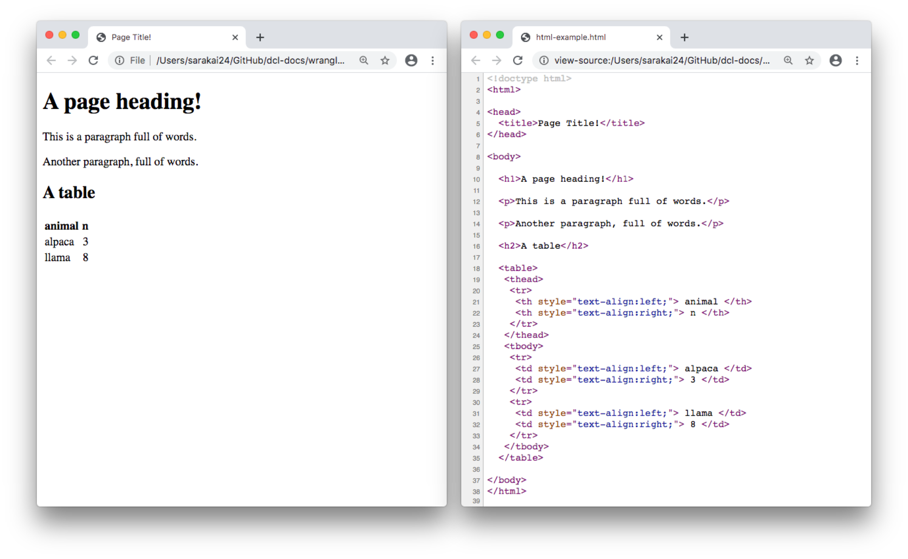
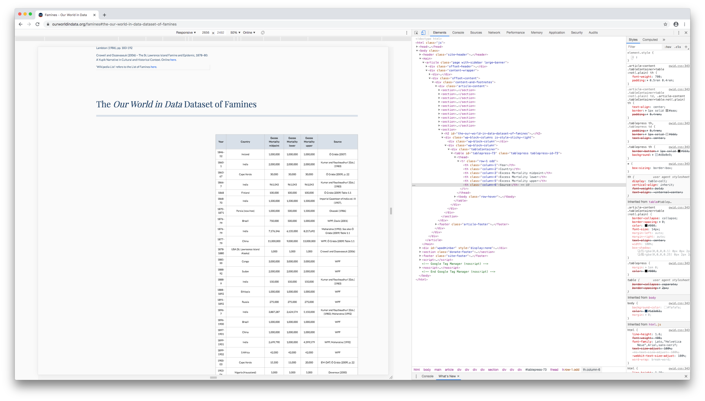
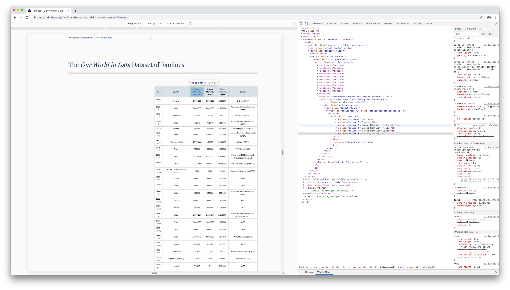
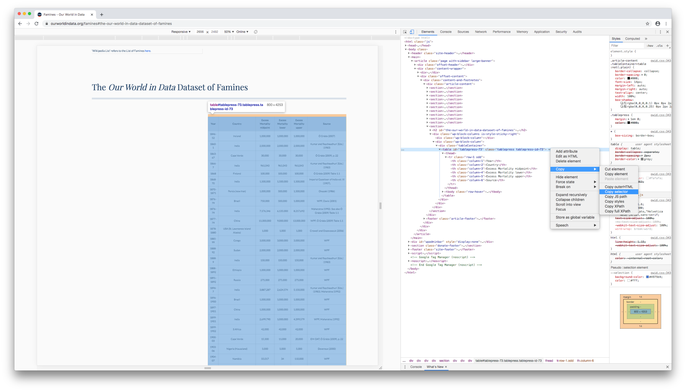

# (PART) Web scraping {-} 

# rvest


```r
library(tidyverse)
library(rvest)
```

The [rvest](https://rvest.tidyverse.org/index.html) package (as in "harvest") allows you to scrape information from a web page and read it into R. In this chapter, we'll explain the basics of rvest and walk you through an example. 

## Web page basics

### HTML

HTML (_Hyper Text Markup Language_) defines the content and structure of a web page. In Chrome, you can view the HTML that generates a given web page by navigating to _View_ > _Developer_ > _Developer tools_.

A series of elements, like paragraphs, headers, and tables, make up every HTML page. Here's a very simple web page and the HTML that generates it. 



The words surrounded by `< >` are HTML _tags_. Tags define where an element starts and ends. Elements, like paragraph (`<p>`), headings (`<h1>`), and tables (`<table>`), start with an opening tag (`<tagname>`) and end with the corresponding closing tag (`</tagname>`).

Elements can be nested inside other elements. For example, notice that the `<tr>` tags,  which generate rows of a table, are nested inside the `<table>` tag, and the `<td>` tags, which define the cells, are nested inside `<tr>` tags. 

The HTML contains all the information we'd need if we wanted to read the animal data into R, but we'll need rvest to extract the table and turn it into a data frame.

### CSS

CSS (_Cascading Style Sheets_) defines the appearance of HTML elements. _CSS selectors_ are often used to style particular subsets of elements, but you can also use them to extract elements from a web page. 

CSS selectors often reflect the structure of the web page. For example, the CSS selector for the example page's heading is

`body > h1`

and the selector for the entire table is 

`body > table`

You don't need to generate CSS selectors yourself. In the next section, we'll show you how to use your browser to figure out the correct selector.

## Scrape data with rvest

[Our World in Data](https://ourworldindata.org) compiled data on world famines and made it available in [a table](https://ourworldindata.org/famines#the-our-world-in-data-dataset-of-famines). 


Using this table as an example, we'll show you how to use rvest to scrape a web page's HTML, read in a particular element, and then convert HTML to a data frame.

### Read HTML

First, copy the url of the web page and store it in a parameter.


```r
url_data <- "https://ourworldindata.org/famines"
```

Next, use `rvest::read_html()` to read all of the HTML into R.


```r
url_data %>% 
  read_html()
#> {html_document}
#> <html>
#> [1] <head>\n<meta http-equiv="Content-Type" content="text/html; charset=UTF-8 ...
#> [2] <body class="">\n<header class="site-header"><div class="wrapper site-nav ...
```

`read_html()` reads in all the HTML for the page. The page contains far more information than we need, so next we'll extract just the famines data table. 

### Find the CSS selector

We'll find the CSS selector of the famines table and then use that selector to extract the data. 

In Chrome, right click on a cell near the top of the table, then click _Inspect_ (or _Inspect element_ in Safari or Firefox).


The developer console will open and highlight the HTML element corresponding to the cell you clicked.



Hovering over different HTML elements in the _Elements_ pane will highlight different parts of the web page.



Move your mouse up the HTML document, hovering over different lines until the entire table (and only the table) is highlighted. This will often be a line with a `<table>` tag.


Right click on the line, then click _Copy_ > _Copy selector_ (Firefox: _Copy_ > _CSS selector_; Safari: _Copy_ > _Selector Path_).



Return to RStudio, create a variable for your CSS selector, and paste in the selector you copied.


```r
css_selector <- "#tablepress-73"
```

### Extract the table

You already saw how to read HTML into R with `rvest::read_html()`. Next, use `rvest::html_element()` to select just the element identified by your CSS selector. 


```r
url_data %>% 
  read_html() %>% 
  html_element(css = css_selector) 
#> {html_node}
#> <table id="tablepress-73" class="tablepress tablepress-id-73">
#> [1] <thead><tr class="row-1 odd">\n<th class="column-1">Year</th>\n<th class= ...
#> [2] <tbody class="row-hover">\n<tr class="row-2 even">\n<td class="column-1"> ...
```

The data is still in HTML. Use `rvest::html_table()` to turn the output into a tibble.


```r
url_data %>% 
  read_html() %>% 
  html_element(css = css_selector) %>% 
  html_table()
#> # A tibble: 77 × 6
#>   Year    Country    `Excess Mortalit… `Excess Mortali… `Excess Mortali… Source 
#>   <chr>   <chr>      <chr>             <chr>            <chr>            <chr>  
#> 1 1846–52 Ireland    1,000,000         1,000,000        1,000,000        Ó Grád…
#> 2 1860-1  India      2,000,000         2,000,000        2,000,000        Kumar …
#> 3 1863-67 Cape Verde 30,000            30,000           30,000           Ó Grád…
#> 4 1866-7  India      961,043           961,043          961,043          Kumar …
#> 5 1868    Finland    100,000           100,000          100,000          Ó Grád…
#> 6 1868-70 India      1,500,000         1,500,000        1,500,000        Imperi…
#> # … with 71 more rows
```

Now, the data is ready for wrangling in R.

Note that `html_table()` will only work if the HTML element you've supplied is a table. If, for example, we wanted to extract a paragraph of text, we'd use `html_text()` instead.


```r
css_selector_paragraph <- 
  "body > main > article > div.content-wrapper > div.offset-content > div > div > section:nth-child(1) > div > div:nth-child(1) > p:nth-child(9)"

url_data %>% 
  read_html() %>% 
  html_element(css = css_selector_paragraph) %>% 
  html_text()
#> [1] "The entry is based on a global dataset of famines since the mid-19th century produced by us. This ‘Our World in Data-Dataset of Famines’ can be found at the very end of this document and is preceded by a discussion of how this dataset was constructed and on which sources it is based."
```

