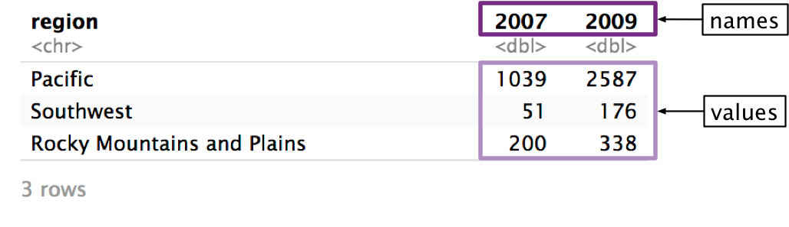

# Basic pivoting

```{r include=FALSE, message=FALSE, warning=FALSE}
library(tidyverse)

eagle_nests <- 
  here::here("data/eagles/eagle_nests.rds") %>% 
  read_rds()
  
eagle_nests_tidy <- 
  here::here("data/eagles/eagle_nests_tidy.rds") %>% 
  read_rds()

eagle_pairs <-
  here::here("data/eagles/eagle_pairs.rds") %>% 
  read_rds()

acs <- 
  here::here("data/acs/acs_2016_1.rds") %>% 
  read_rds()

migration_2017 <-
  here::here("data/migration/migration_2017.rds") %>% 
  read_rds()
```

Most of the data you'll encounter won't be tidy, and it will be your job to figure out how to make it tidy. In this chapter, you'll learn about two of the most important tidying tools: `pivot_longer()` and `pivot_wider()`. 

First, recall the characteristics of tidy data:

* Each value has its own cell.
* Each variable has its own column.
* Each observation has its own row.

```{r echo=FALSE}
knitr::include_graphics("images/pivot/tidy_elements.png", dpi = image_dpi)
```

Non-tidy data will not fulfill one or more of these characteristics.

## Longer

`eagle_nests` contains data on the number of [bald eagle nesting sites](https://www.fws.gov/migratorybirds/pdf/management/EagleRuleRevisions-StatusReport.pdf#page=19&zoom=100,0,700) across multiple regions and years.

```{r}
# Source: US Fish and Wildlife Service
eagle_nests
```

The data isn't tidy. In the following steps, we'll show you how to tidy `eagle_nests` using `pivot_longer()`. 

__Step 1__: Identify the variables.

There are three variables in this dataset:

* `region`: The US region where the nests are located.
* `year`: The year the nests were found. 
* `num_nests`: The number of nests found. 

Only one of these variables (`region`) is currently a column. Values of `year` are currently stored horizontally as column names, and values of `num_nests` are stored as values of `2007` and `2009`. In order for this data to be tidy, we'll need to pivot `2007` and `2009` into a `year` column, and the values of `2007` and `2009` into a `num_nests` column.

```{r echo=FALSE}
knitr::include_graphics("images/pivot/longer_overview.png", dpi = image_dpi)
```

Now that we've identified the variables, we can start filling in our call to `pivot_longer()`. We'll need three arguments, which we'll identify over the next three steps. 

```{r eval=FALSE}
eagle_nests %>% 
  pivot_longer(
    # Step 2
    # Step 3
    # Step 4
  )
```

__Step 2__: Identify the columns to pivot.

To decide which columns to pivot, identify which columns are keeping the data from being tidy. In our example, those columns are `2007` and `2009`. 

```{r echo=FALSE}
knitr::include_graphics("images/pivot/longer_cols.png", dpi = image_dpi)
```

`2007` and `2009` are actually values of `year`, not variables themselves, and their values are actually values of `num_nests`. 

The `cols` argument controls which columns `pivot_longer()` pivots. 

```{r eval=FALSE}
eagle_nests %>% 
  pivot_longer(
    cols = c(`2007`, `2009`),
    # Step 3
    # Step 4
  )
```

`cols` is similar to `select()`. You can specify columns by name, with `contains()`, `starts_with()`, etc. Here, we have to wrap `2007` and `2009` in backticks (``` ` ` ```) because they start with numbers.

__Step 3__: Name the column that will store the values from the column names.

Now, we're just going to focus on the columns we identified in `cols`. Ultimately, `pivot_longer()` is going to move both the names of these columns and their values into new, separate columns. 

```{r echo=FALSE}

```

First, we’ll focus on the column names: `2007` and `2009`. `pivot_longer()`’s `names_to` argument controls the name of the column that will store the old column names. We want to name this new column `"year"`. The argument is called `names_to` because you’re specifying which column to move the column __names__ to.

```{r eval=FALSE}
eagle_nests %>% 
  pivot_longer(
    cols = c(`2007`, `2009`),
    names_to = "year",
    # Step 4
  )
```

Note that the argument to `names_to` has to be in quotes, while the arguments to `cols` do not. It's easy to get confused about which pivot arguments need to be quoted. Here's the general rule: if you're identifying an existing column (e.g., `2007`), do not quote. If you're talking about a column that does not currently exist (e.g., `year`), quote it. 

Now, `pivot_longer()` will create a new column called `year` and fill it with the column names `2007` and `2009`. Because we specified two columns in `cols`, we will get two values of `year` for each region. 

```{r echo=FALSE}
knitr::include_graphics("images/pivot/longer_1.png", dpi = image_dpi)
```

__Step 4__: Name the column that will store the column values.

Now, we need to name the column that will store the values from `2007` and `2009`.

```{r echo=FALSE}
knitr::include_graphics("images/pivot/longer_values.png", dpi = image_dpi)
```

Just as `names_to` controls the name of the column for the names, `values_to` controls the name of column for the values. In `eagle_nests`, the column values represent the number of nests, so we'll name the new column `"num_nests"`. 

```{r eval=FALSE}
eagle_nests %>% 
  pivot_longer(
    cols = c(`2007`, `2009`), 
    names_to = "year", 
    values_to = "num_nests"
  )
```

Again, notice that you have to quote any argument to `values_to` because it references a column that does not exist. 

`pivot_longer()` will now move the values from `2007` and `2009` to a column called `num_nests`.

```{r echo=FALSE}
knitr::include_graphics("images/pivot/longer_2.png", dpi = image_dpi)
```

Here's the function call again with the results.

```{r}
eagle_nests %>% 
  pivot_longer(
    cols = c(`2007`, `2009`), 
    names_to = "year", 
    values_to = "num_nests"
  )
```

The data is now tidy! `pivot_longer()` has many optional arguments, but `cols`, `names_to`, and `values_to` will cover most of your use-cases. The _Missing values_ and _Advanced_ sections covers some more specialized uses of `pivot_longer()`. 

Here's another eagle-related example. `eagle_pairs` contains data on the number of observed [bald eagle breeding pairs](https://www.fws.gov/midwest/eagle/NestingData/nos_state_tbl.html) across years and states. 

```{r}
eagle_pairs
```

Again, the date isn't tidy because values are spread across column names. We need to pivot all the year columns (`1997` through `2006`), moving their names into a column named `"year"` and their values into a column named `"num_nests"`. 

Here's the full call to `pivot_longer()`:

```{r}
eagle_pairs %>% 
  pivot_longer(
    cols = -starts_with("state"), 
    names_to = "year",
    values_to = "num_pairs"
  )
```

## Wider

`pivot_wider()` is the reverse of `pivot_longer()`. `pivot_longer()` moves data from column names to cell values, while `pivot_wider()` pulls data from cell values into column names, creating a wider tibble.

You'll likely use `pivot_longer()` more often than `pivot_wider()` when tidying. Often, you'll actually use `pivot_wider()` to un-tidy data. The non-tidy format may be more convenient for some tasks (e.g., creating a specific visualization).

To explain `pivot_wider()`, we'll turn the tidied `eagle_nests` back into its original form. Here's the tidied version:

```{r}
eagle_nests_tidy
```

__Step 1__ Identify the column whose values will supply the column names.

`pivot_wider()` turns the values from one column and turns them into column names. In our example, we want the unique values from `year` to become column names. 

```{r echo=FALSE}
knitr::include_graphics("images/pivot/wider_names.png", dpi = image_dpi)
```

`pivot_wider()`'s `names_from` argument controls which column is pivoted into column names. 

```{r eval=FALSE}
eagle_nests_tidy %>% 
  pivot_wider(
    names_from = year,
    # Step 2
    )
```

Notice that `year` is unquoted because, following the rule, `year` does exist in `eagle_nests_tidy`.

__Step 2__ Identify the column whose values will supply the column values.

Now, we need to identify the column that will supply the values of `2007` and `2009`. In `eagle_nests_tidy`, that's `num_nests`.

```{r echo=FALSE}
knitr::include_graphics("images/pivot/wider_values.png", dpi = image_dpi)
```

We specify `num_nests` as the `values_from` argument.

```{r}
eagle_nests_tidy %>% 
  pivot_wider(
    names_from = year, 
    values_from = num_nests
  )
```

Again, supply the name of the column unquoted. 

We're done! The tibble is now transformed back into its original form. 

Let's see an example of a tibble that actually does need `pivot_wider()` to be tidy. `acs` contains data from the 2012-2016 [American Community Survey](https://www.census.gov/programs-surveys/acs), obtained through the [tidycensus](https://walkerke.github.io/tidycensus/) package. 

```{r}
acs
```

`variable` and `estimate` are not really variables (if you see a variable named `variable` it's a good sign you need `pivot_wider()`). There are three distinct values in `variable`:

```{r}
acs %>% 
  distinct(variable)
```

Each of these values is actually a variable whose values are currently stored in `estimate`. To pivot, we'll set `names_from` to `variable` and `values_from` to `estimate`. 

```{r}
acs %>% 
  pivot_wider(names_from = variable, values_from = estimate)
```

`pivot_wider()`'s first argument isn't actually `names_from`--it's a different argument named `id_cols`. This means that if you don't name `names_from` and `values_from`, you'll get a strange error:

```{r error=TRUE}
eagle_nests_tidy %>% 
  pivot_wider(year, num_nests)
```

`pivot_wider()` thinks you're supplying `variable` to `id_cols`. We'll talk more about what `id_cols` actually does in the _Advanced_ section. For now, it's enough to know that you should name `names_from` and `values_from` to avoid the error. 

## Missing values

The United Nations compiles [data](https://www.un.org/en/development/desa/population/migration/data/estimates2/estimates19.asp) on the origin and destination countries of international migrants. `migration_2017` contains a subset of this data from 2017. The countries in the column names represent countries of origin, and the countries in `dest` represent destination countries. 

```{r}
migration_2017
```

Again, the data isn't tidy. `Afghanistan`, `Canada`, etc. are values of a variable, not variables themselves. We can use `pivot_longer()` to tidy the data.

```{r}
migration_2017 %>% 
  pivot_longer(cols = -dest, names_to = "origin", values_to = "migrants")
```

There are a lot of `NA`s in the data. However, they don't actually represent missing values. Someone didn't forget to measure the number of migrants Afghanistan to Albania---there just aren't any. It doesn't really make sense to include these rows in our new, tidied dataset. We can use `values_drop_na` to exclude these rows.

```{r}
migration_2017 %>% 
  pivot_longer(
    cols = -dest, 
    names_to = "origin", 
    values_to = "migrants", 
    values_drop_na = TRUE
  ) 
```

When you use `values_drop_na = TRUE` in `pivot_longer()`, you're turning _explicit_ missing values into _implicit_ missing values. This is only a good idea if the `NA`s were in the non-tidy data for a purely structural reason, like in `migration_2017`. 

```{r echo=FALSE}
knitr::include_graphics("images/pivot/missing_values.png", dpi = image_dpi)
```

`eagle_pairs`'s `NA`s aren't structual, and represent actual missing data. Paired Alabamian eagles probably existed in 2001, but the data isn't there. 

```{r}
eagle_pairs
```

If we used `values_drop_na = TRUE` when we pivoted `eagle_pairs`, we would turn all these explicit missing values implicit, which isn't a good idea. 


[^1]: Tidy Data (vignette). https://tidyr.tidyverse.org/articles/tidy-data.html.
