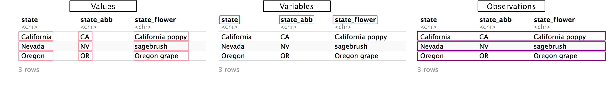
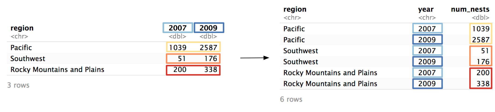
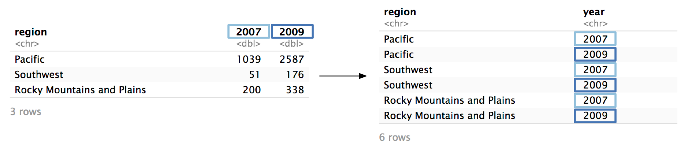
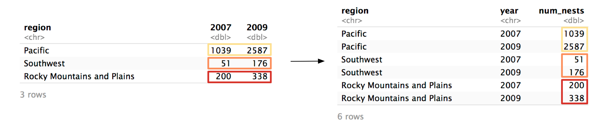
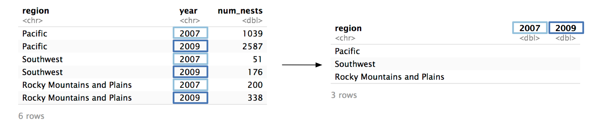
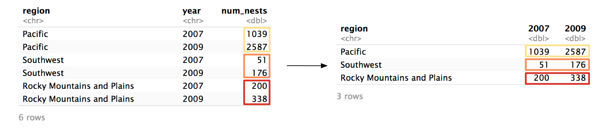

# Basic pivoting


```r
library(dcldata)
```


Most of the data you'll encounter won't be tidy, and it will be your job to figure out how to make it tidy. In this chapter, you'll learn about two of the most important tidying tools: `pivot_longer()` and `pivot_wider()`. 

First, recall the characteristics of tidy data:

* Each value has its own cell.
* Each variable has its own column.
* Each observation has its own row.



Non-tidy data will not fulfill one or more of these characteristics.

## Longer

`example_eagle_nests` contains data on the number of [bald eagle nesting sites](https://www.fws.gov/migratorybirds/pdf/management/EagleRuleRevisions-StatusReport.pdf#page=19&zoom=100,0,700) across multiple regions and years.


```r
# Source: US Fish and Wildlife Service
example_eagle_nests
```

```
#> # A tibble: 3 x 3
#>   region                     `2007` `2009`
#>   <chr>                       <dbl>  <dbl>
#> 1 Pacific                      1039   2587
#> 2 Southwest                      51    176
#> 3 Rocky Mountains and Plains    200    338
```

The data isn't tidy. In the following steps, we'll show you how to tidy `example_eagle_nests` using `pivot_longer()`. 

__Step 1__: Identify the variables.

There are three variables in this dataset:

* `region`: The US region where the nests are located.
* `year`: The year the nests were found. 
* `num_nests`: The number of nests found. 

Only one of these variables (`region`) is currently a column. Values of `year` are currently stored horizontally as column names, and values of `num_nests` are stored as values of `2007` and `2009`. In order for this data to be tidy, we'll need to pivot `2007` and `2009` into a `year` column, and the values of `2007` and `2009` into a `num_nests` column.



Now that we've identified the variables, we can start filling in our call to `pivot_longer()`. We'll need three arguments, which we'll identify over the next three steps. 


```r
example_eagle_nests %>% 
  pivot_longer(
    # Step 2
    # Step 3
    # Step 4
  )
```

__Step 2__: Identify the columns to pivot.

To decide which columns to pivot, identify which columns are keeping the data from being tidy. In our example, those columns are `2007` and `2009`. 


`2007` and `2009` are actually values of `year`, not variables themselves, and their values are actually values of `num_nests`. 

The `cols` argument controls which columns `pivot_longer()` pivots. 


```r
example_eagle_nests %>% 
  pivot_longer(
    cols = c(`2007`, `2009`),
    # Step 3
    # Step 4
  )
```

`cols` is similar to `select()`. You can specify columns by name, with `contains()`, `starts_with()`, etc. Here, we have to wrap `2007` and `2009` in backticks (``` ` ` ```) because they start with numbers.

__Step 3__: Name the column that will store the values from the column names.

Now, we're just going to focus on the columns we identified in `cols`. Ultimately, `pivot_longer()` is going to move both the names of these columns and their values into new, separate columns. 


First, we’ll focus on the column names: `2007` and `2009`. `pivot_longer()`’s `names_to` argument controls the name of the column that will store the old column names. We want to name this new column `"year"`. The argument is called `names_to` because you’re specifying which column to move the column __names__ to.


```r
example_eagle_nests %>% 
  pivot_longer(
    cols = c(`2007`, `2009`),
    names_to = "year",
    # Step 4
  )
```

Note that the argument to `names_to` has to be in quotes, while the arguments to `cols` do not. It's easy to get confused about which pivot arguments need to be quoted. Here's the general rule: if you're identifying an existing column (e.g., `2007`), do not quote. If you're talking about a column that does not currently exist (e.g., `year`), quote it. 

Now, `pivot_longer()` will create a new column called `year` and fill it with the column names `2007` and `2009`. Because we specified two columns in `cols`, we will get two values of `year` for each region. 



__Step 4__: Name the column that will store the column values.

Now, we need to name the column that will store the values from `2007` and `2009`.


Just as `names_to` controls the name of the column for the names, `values_to` controls the name of column for the values. In `example_eagle_nests`, the column values represent the number of nests, so we'll name the new column `"num_nests"`. 


```r
example_eagle_nests %>% 
  pivot_longer(
    cols = c(`2007`, `2009`), 
    names_to = "year", 
    values_to = "num_nests"
  )
```

Again, notice that you have to quote any argument to `values_to` because it references a column that does not exist. 

`pivot_longer()` will now move the values from `2007` and `2009` to a column called `num_nests`.



Here's the function call again with the results.


```r
example_eagle_nests %>% 
  pivot_longer(
    cols = c(`2007`, `2009`), 
    names_to = "year", 
    values_to = "num_nests"
  )
```

```
#> # A tibble: 6 x 3
#>   region                     year  num_nests
#>   <chr>                      <chr>     <dbl>
#> 1 Pacific                    2007       1039
#> 2 Pacific                    2009       2587
#> 3 Southwest                  2007         51
#> 4 Southwest                  2009        176
#> 5 Rocky Mountains and Plains 2007        200
#> 6 Rocky Mountains and Plains 2009        338
```

The data is now tidy! `pivot_longer()` has many optional arguments, but `cols`, `names_to`, and `values_to` will cover most of your use-cases. The _Missing values_ section and the _Advanced pivoting_ chapter cover some more specialized uses of `pivot_longer()`. 

Here's another eagle-related example. `example_eagle_pairs` contains data on the number of observed [bald eagle breeding pairs](https://www.fws.gov/midwest/eagle/NestingData/nos_state_tbl.html) across years and states. 


```r
example_eagle_pairs
```

```
#> # A tibble: 48 x 12
#>   state state_abbr `1997` `1998` `1999` `2000` `2001` `2002` `2003` `2004`
#>   <chr> <chr>       <int>  <int>  <int>  <int>  <int>  <int>  <int>  <int>
#> 1 Alab… AL             22     23     26     27     NA     NA     47     NA
#> 2 Ariz… AZ             34     36     38     37     37     43     43     NA
#> 3 Arka… AR             24     29     34     36     NA     NA     36     42
#> 4 Cali… CA            142    148    151     NA     NA     NA    160     NA
#> 5 Colo… CO             29     27     29     42     45     NA     NA     NA
#> 6 Conn… CT              2      2      2      4      6      8      8     NA
#> # … with 42 more rows, and 2 more variables: `2005` <int>, `2006` <int>
```

Again, the data isn't tidy because values are spread across column names. We need to pivot all the year columns (`1997` through `2006`), moving their names into a column named `"year"` and their values into a column named `"num_nests"`. 

Here's the full call to `pivot_longer()`:


```r
example_eagle_pairs %>% 
  pivot_longer(
    cols = -starts_with("state"), 
    names_to = "year",
    values_to = "num_pairs"
  )
```

```
#> # A tibble: 480 x 4
#>   state   state_abbr year  num_pairs
#>   <chr>   <chr>      <chr>     <int>
#> 1 Alabama AL         1997         22
#> 2 Alabama AL         1998         23
#> 3 Alabama AL         1999         26
#> 4 Alabama AL         2000         27
#> 5 Alabama AL         2001         NA
#> 6 Alabama AL         2002         NA
#> # … with 474 more rows
```

## Wider

`pivot_wider()` is the inverse of `pivot_longer()`. `pivot_longer()` moves data from column names to cell values, while `pivot_wider()` pulls data from cell values into column names, creating a wider tibble.

You'll likely use `pivot_longer()` more often than `pivot_wider()` when tidying. Often, you'll actually use `pivot_wider()` to un-tidy data. The non-tidy format may be more convenient for some tasks (e.g., creating a specific visualization).

To explain `pivot_wider()`, we'll turn the tidied `example_eagle_nests` back into its original form. Here's the tidied version:


```r
example_eagle_nests_tidy
```

```
#> # A tibble: 6 x 3
#>   region                     year  num_nests
#>   <chr>                      <chr>     <dbl>
#> 1 Pacific                    2007       1039
#> 2 Pacific                    2009       2587
#> 3 Southwest                  2007         51
#> 4 Southwest                  2009        176
#> 5 Rocky Mountains and Plains 2007        200
#> 6 Rocky Mountains and Plains 2009        338
```

__Step 1__ Identify the column whose values will supply the column names.

`pivot_wider()` turns the values from one column and turns them into column names. In our example, we want the unique values from `year` to become column names. 



`pivot_wider()`'s `names_from` argument controls which column is pivoted into column names. 


```r
example_eagle_nests_tidy %>% 
  pivot_wider(
    names_from = year,
    # Step 2
    )
```

Notice that `year` is unquoted because, following the rule, `year` does exist in `example_eagle_nests_tidy`.

__Step 2__ Identify the column whose values will supply the column values.

Now, we need to identify the column that will supply the values of `2007` and `2009`. In `example_eagle_nests_tidy`, that's `num_nests`.



We specify `num_nests` as the `values_from` argument.


```r
example_eagle_nests_tidy %>% 
  pivot_wider(
    names_from = year, 
    values_from = num_nests
  )
```

```
#> # A tibble: 3 x 3
#>   region                     `2007` `2009`
#>   <chr>                       <dbl>  <dbl>
#> 1 Pacific                      1039   2587
#> 2 Southwest                      51    176
#> 3 Rocky Mountains and Plains    200    338
```

Again, supply the name of the column unquoted. 

We're done! The tibble is now transformed back into its original form. 

Let's see an example of a tibble that actually does need `pivot_wider()` to be tidy. `example_acs_1` contains data from the 2013-2017 [American Community Survey](https://www.census.gov/programs-surveys/acs), obtained through the [tidycensus](https://walkerke.github.io/tidycensus/) package. 


```r
example_acs_1
```

```
#> # A tibble: 156 x 4
#>   geoid name    variable    estimate
#>   <chr> <chr>   <chr>          <dbl>
#> 1 01    Alabama pop_housed   4731852
#> 2 01    Alabama pop_renter   1434765
#> 3 01    Alabama median_rent      747
#> 4 02    Alaska  pop_housed    710743
#> 5 02    Alaska  pop_renter    241484
#> 6 02    Alaska  median_rent     1200
#> # … with 150 more rows
```

`variable` and `estimate` are not really variables (if you see a variable named `variable` it's a good sign you need `pivot_wider()`). There are three distinct values in `variable`:


```r
example_acs_1 %>% 
  distinct(variable)
```

```
#> # A tibble: 3 x 1
#>   variable   
#>   <chr>      
#> 1 pop_housed 
#> 2 pop_renter 
#> 3 median_rent
```

Each of these values is actually a variable whose values are currently stored in `estimate`. To pivot, we'll set `names_from` to `variable` and `values_from` to `estimate`. 


```r
example_acs_1 %>% 
  pivot_wider(names_from = variable, values_from = estimate)
```

```
#> # A tibble: 52 x 5
#>   geoid name       pop_housed pop_renter median_rent
#>   <chr> <chr>           <dbl>      <dbl>       <dbl>
#> 1 01    Alabama       4731852    1434765         747
#> 2 02    Alaska         710743     241484        1200
#> 3 04    Arizona       6656124    2460534         972
#> 4 05    Arkansas      2894098     965690         709
#> 5 06    California   38168482   17066023        1358
#> 6 08    Colorado      5318396    1782975        1125
#> # … with 46 more rows
```

`pivot_wider()`'s first argument isn't actually `names_from`---it's a different argument named `id_cols`. This means that if you don't name `names_from` and `values_from`, you'll get a strange error:


```r
example_eagle_nests_tidy %>% 
  pivot_wider(year, num_nests)
```

```
#> Error in `$<-.data.frame`(`*tmp*`, ".name", value = "_"): replacement has 1 row, data has 0
```

`pivot_wider()` thinks you're supplying `variable` to `id_cols`. We'll talk more about what `id_cols` actually does in the _Advanced pivoting_ chapter. For now, it's enough to know that you should name `names_from` and `values_from` to avoid the error. 

## Missing values

The United Nations compiles [data](https://www.un.org/en/development/desa/population/migration/data/estimates2/estimates19.asp) on the origin and destination countries of international migrants. `example_migration` contains a subset of this data from 2017. The countries in the column names represent countries of origin, and the countries in `dest` represent destination countries. 


```r
example_migration
```

```
#> # A tibble: 3 x 6
#>   dest     Afghanistan Canada India Japan `South Africa`
#>   <chr>    <chr>       <chr>  <chr> <chr> <chr>         
#> 1 Albania  <NA>        913    <NA>  <NA>  <NA>          
#> 2 Bulgaria 483         713    281   213   260           
#> 3 Romania  <NA>        <NA>   102   <NA>  <NA>
```

Again, the data isn't tidy. `Afghanistan`, `Canada`, etc. are values of a variable, not variables themselves. We can use `pivot_longer()` to tidy the data.


```r
example_migration %>% 
  pivot_longer(cols = -dest, names_to = "origin", values_to = "migrants")
```

```
#> # A tibble: 15 x 3
#>   dest     origin       migrants
#>   <chr>    <chr>        <chr>   
#> 1 Albania  Afghanistan  <NA>    
#> 2 Albania  Canada       913     
#> 3 Albania  India        <NA>    
#> 4 Albania  Japan        <NA>    
#> 5 Albania  South Africa <NA>    
#> 6 Bulgaria Afghanistan  483     
#> # … with 9 more rows
```

There are a lot of `NA`s in the data. However, they don't actually represent missing values. Someone didn't forget to measure the number of migrants Afghanistan to Albania---there just weren't any. It doesn't really make sense to include these rows in our new, tidied dataset. We can use `values_drop_na` to exclude these rows.


```r
example_migration %>% 
  pivot_longer(
    cols = -dest, 
    names_to = "origin", 
    values_to = "migrants", 
    values_drop_na = TRUE
  ) 
```

```
#> # A tibble: 7 x 3
#>   dest     origin       migrants
#>   <chr>    <chr>        <chr>   
#> 1 Albania  Canada       913     
#> 2 Bulgaria Afghanistan  483     
#> 3 Bulgaria Canada       713     
#> 4 Bulgaria India        281     
#> 5 Bulgaria Japan        213     
#> 6 Bulgaria South Africa 260     
#> # … with 1 more row
```

When you use `values_drop_na = TRUE` in `pivot_longer()`, you're turning _explicit_ missing values into _implicit_ missing values. This is only a good idea if the `NA`s were in the non-tidy data for a purely structural reason, like in `example_migration`. 


`example_eagle_pairs`'s `NA`s aren't structual, and represent actual missing data. Paired Alabamian eagles probably existed in 2001, but the data isn't there. 


```r
example_eagle_pairs
```

```
#> # A tibble: 48 x 12
#>   state state_abbr `1997` `1998` `1999` `2000` `2001` `2002` `2003` `2004`
#>   <chr> <chr>       <int>  <int>  <int>  <int>  <int>  <int>  <int>  <int>
#> 1 Alab… AL             22     23     26     27     NA     NA     47     NA
#> 2 Ariz… AZ             34     36     38     37     37     43     43     NA
#> 3 Arka… AR             24     29     34     36     NA     NA     36     42
#> 4 Cali… CA            142    148    151     NA     NA     NA    160     NA
#> 5 Colo… CO             29     27     29     42     45     NA     NA     NA
#> 6 Conn… CT              2      2      2      4      6      8      8     NA
#> # … with 42 more rows, and 2 more variables: `2005` <int>, `2006` <int>
```

If we used `values_drop_na = TRUE` when we pivoted `example_eagle_pairs`, we would turn all these explicit missing values implicit, which isn't a good idea. 
